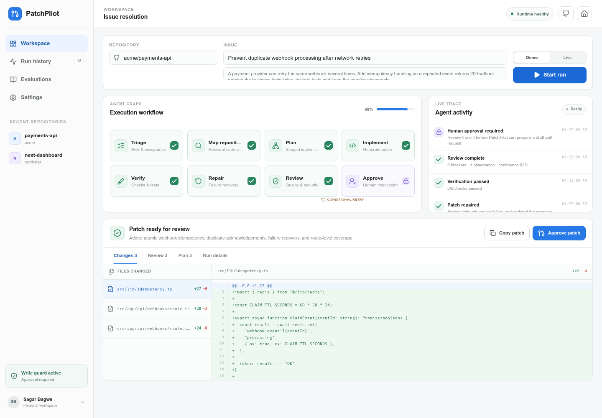
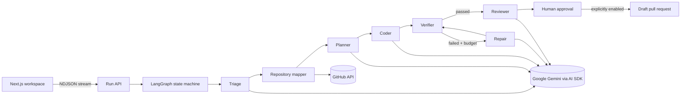

# PatchPilot

**An observable, human-controlled agent workflow that turns a GitHub issue
into a reviewed patch.**

[Live demo](https://your-project.vercel.app) ·
[Architecture](#architecture) ·
[Run locally](#quick-start) ·
[Evaluation](#evaluation)



PatchPilot demonstrates the production engineering around an AI agent—not
only the model call. A typed LangGraph workflow triages an issue, maps the
repository, plans a scoped implementation, generates file changes, verifies
them, repairs a failed attempt, performs a security-minded review, and stops at
a human approval boundary.

The included demo is deterministic and works without an API key. Gemini mode
can read a public or authorized GitHub repository and use Google Gemini for all
model-backed agent steps.

## Why this project exists

Most agent demos hide their execution behind a chat box. PatchPilot makes the
workflow inspectable:

- every specialized node has a clear responsibility and typed output;
- the UI streams node status and concise execution traces;
- verification can route the graph through a bounded repair loop;
- generated changes are visible in a Git-style diff viewer;
- repository writes are disabled unless a human approves and the server owner
  explicitly enables them;
- cost, latency, checks, file count, and repair attempts are reported per run.
- completed browser runs appear in a searchable, filterable history page;
- settings report deployed Gemini/GitHub capability without exposing secrets;
- the evaluation page explains benchmark results and methodology.

## Product tour

### 1. Start with an issue

Paste `owner/repository`, add the issue title and acceptance context, then
choose:

- **Demo** — deterministic fixture, no keys or external writes.
- **Gemini** — bounded GitHub context retrieval plus Gemini-backed agents.

### 2. Watch the state graph

The dashboard shows each node transition, including a failed first
verification and a conditional repair route.

### 3. Inspect the artifact

Review full file paths, additions/deletions, unified diff hunks, implementation
plan, review findings, and run metrics.

### 4. Approve deliberately

Approval calls a separate endpoint. It remains a dry run unless both a
fine-grained GitHub token and the write safety switch are configured. Enabled
writes create a new branch, commit the proposed file contents, and open a
**draft** pull request.

### 5. Review history and configuration

- **Run history** persists the latest 25 completed runs in the current browser.
- **Evaluations** presents the checked-in 12-scenario benchmark.
- **Settings** reports whether Gemini, GitHub authentication, and write access
  are configured, and lets the browser remember Demo or Gemini as its default.

## Architecture



### Agent contract

| Node | Responsibility | Typed artifact |
| --- | --- | --- |
| Triage | Classify work and make “done” testable | risk + acceptance criteria |
| Repository mapper | Load a bounded, relevant code snapshot | branch + language + paths |
| Planner | Design the smallest safe change | ordered file-scoped plan |
| Coder | Produce reviewable file replacements | file changes + unified hunks |
| Verifier | Run deterministic preflight checks | named pass/fail checks |
| Repair | Correct structured verification failures | revised file changes |
| Reviewer | Find concrete correctness/security issues | severity-ranked findings |
| Approval | Enforce the trust boundary | immutable run result |

## Technology

- **Next.js 16**, React 19, and strict TypeScript
- **LangGraph** for stateful orchestration and conditional routing
- **Vercel AI SDK** with the official Google Gemini provider
- **Octokit** for bounded repository reads and draft pull requests
- **Zod** contracts at API and agent boundaries
- native Web Streams with newline-delimited JSON for live execution events
- custom responsive UI with accessible controls and reduced-motion support
- Node test runner, deterministic evaluation harness, and GitHub Actions CI

## Safe-by-default design

1. Demo mode has no external side effects.
2. Live repository reads are restricted to text files under 60 KB and a
   maximum of 10 selected files.
3. Generated paths cannot be absolute, traverse directories, or use Windows
   separators.
4. Preflight checks include secret patterns, JSON parsing, delimiter balance,
   patch size, and path safety.
5. A repair budget prevents unbounded loops.
6. GitHub writes require an explicit human action.
7. Server writes additionally require
   `PATCHPILOT_ENABLE_WRITES=true`.
8. New pull requests are always drafts.

See [SECURITY.md](SECURITY.md) for operational guidance.

## Quick start

### Requirements

- Node.js 20.9 or newer
- npm

### Install and run

```bash
git clone https://github.com/YOUR_USERNAME/patchpilot.git
cd patchpilot
npm install
cp .env.example .env.local
npm run dev
```

Open [http://localhost:3000](http://localhost:3000) and select **Demo**.

Demo mode intentionally needs no environment variables.

## Gemini mode

Get a Gemini API key from
[Google AI Studio](https://aistudio.google.com/apikey).

For local development, add this to `.env.local`:

```bash
GOOGLE_GENERATIVE_AI_API_KEY=...
GEMINI_MODEL=gemini-2.5-flash
GITHUB_TOKEN=... # optional for public repositories
```

Gemini has a limited free tier. Its quota and available models can vary by
account and region.

Keep writes disabled while testing:

```bash
PATCHPILOT_ENABLE_WRITES=false
```

To create draft pull requests, use a fine-grained token limited to the target
repository with **Contents: read/write** and **Pull requests: read/write**, then
set:

```bash
PATCHPILOT_ENABLE_WRITES=true
```

Never expose the GitHub token through a `NEXT_PUBLIC_` variable.

## Deploy to Vercel

1. Push the repository to GitHub.
2. In Vercel, select **Add New → Project** and import the repository.
3. Keep the detected framework as Next.js.
4. Before deploying, add these values in **Project Settings → Environment
   Variables**:

   | Name | Value |
   | --- | --- |
   | `GOOGLE_GENERATIVE_AI_API_KEY` | Your Google AI Studio key |
   | `GEMINI_MODEL` | `gemini-2.5-flash` |
   | `PATCHPILOT_ENABLE_WRITES` | `false` |

5. Select Production, Preview, and Development for each variable.
6. Click **Deploy**. No OpenAI account or key is used anywhere in this build.

The included `vercel.json` selects the Mumbai region for lower latency from
India. Remove the `regions` entry if you prefer Vercel's automatic placement.

## Evaluation

The repository includes a transparent deterministic benchmark with 12 labeled
software-maintenance fixtures:

```bash
npm run eval
```

Current fixture results:

| Metric | Result |
| --- | ---: |
| Pass@1 | 75.0% |
| Pass@2 with one repair | 100.0% |
| Acceptance-criteria coverage | 98.0% |
| Approval-boundary coverage | 100.0% |
| p50 fixture latency | 5.12s |
| p95 fixture latency | 7.31s |

These values measure the checked-in deterministic fixtures, not arbitrary
model quality. The harness makes that limitation explicit so a future
evaluation can replace fixtures with labeled issues from a real repository.

## Commands

```bash
npm run dev        # development server
npm run typecheck  # strict TypeScript check
npm test           # unit tests
npm run eval       # deterministic evaluation harness
npm run build      # production build
npm run check      # all checks above
```

## API surface

| Endpoint | Method | Purpose |
| --- | --- | --- |
| `/api/health` | GET | runtime capability and health check |
| `/api/runs` | POST | start and stream an agent workflow |
| `/api/pull-request` | POST | guarded approval / draft PR creation |

## Project structure

```text
app/
  api/                    streaming workflow and approval routes
  dashboard/              agent workspace
  history/                persisted run history and filters
  evaluations/            benchmark results and methodology
  settings/               runtime health and browser preferences
components/
  workflow-studio.tsx     live graph, trace, diff, and approval UI
  section-page-shell.tsx  shared navigation for secondary pages
lib/
  agent/
    workflow.ts           LangGraph state machine and agent nodes
    static-checks.ts      deterministic verification
    demo-data.ts          no-key portfolio demo
  github.ts               bounded reads and guarded draft PR writes
  history.ts              browser history and preference helpers
evals/                    labeled fixture benchmark
scripts/                  evaluation runner
tests/                    security and parser unit tests
```

## Resume-ready talking points

- Built a stateful eight-node agent workflow with conditional repair routing,
  typed Zod contracts, bounded retries, and human-in-the-loop approval.
- Developed a responsive Next.js dashboard that streams execution events and
  visualizes code diffs, review findings, test results, cost, and latency.
- Integrated GitHub repository analysis and guarded draft pull-request
  creation using least-privilege controls and server-only credentials.
- Added deterministic safety checks, a 12-scenario evaluation harness, unit
  tests, and CI-gated production builds.

## Trade-offs and next steps

- The current verifier performs deterministic static preflight checks. A
  production version should run repository-native tests inside an isolated
  sandbox and stream logs back to the same node.
- The demo stores run state in the browser and request lifetime. Durable runs
  can be added with Postgres plus a background workflow service.
- Path relevance is intentionally simple and explainable. Hybrid code search
  or symbol-aware retrieval would improve large monorepos.
- Before enabling public writes, replace a personal token with a GitHub App,
  add organization installation controls, and persist signed approval records.

## Author

Built by **Sagar Bagwe** as a full-stack and agent-engineering portfolio
project.

## License

[MIT](LICENSE)
